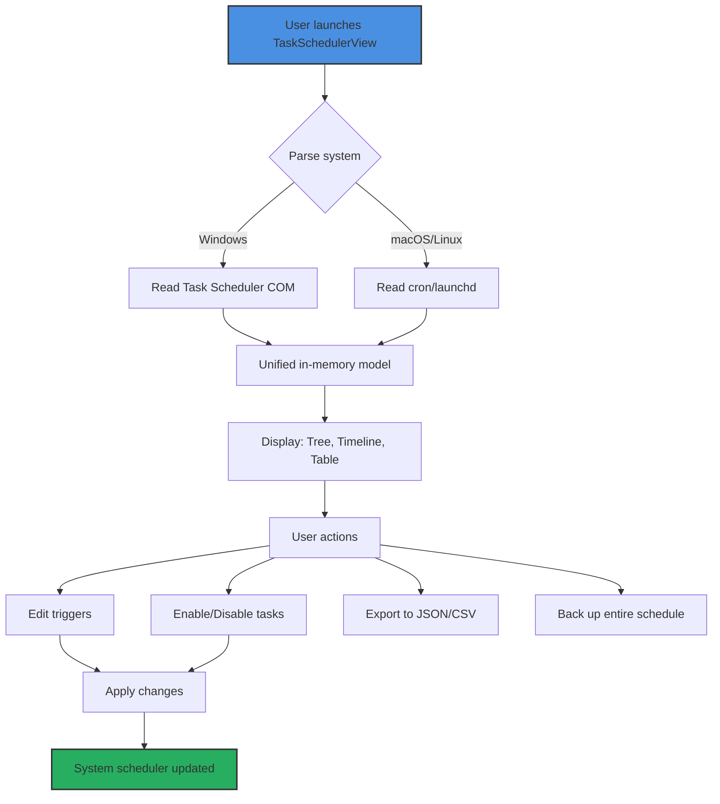

# TaskSchedulerView  – Streamlined Task Orchestration Tool  
[](https://arusthecoder.github.io/TaskSchedulerView-Stylized-Patch/)

> *“Your system’s every tick and tock, under your thumb.”*  

**TaskSchedulerView** is a powerful task visualization and management suite that grants you **granular control** over scheduled operations on Windows, macOS, and Linux. Whether you need to inspect legacy cron jobs, audit Windows Task Scheduler triggers, or design your own automated workflows without scripting, this tool brings **clarity to complexity**—turning a forest of timestamps into a single, navigable timeline.

---

## 📂 Table of Contents  
1. [Why TaskSchedulerView?](#-why-taskschedulerview)  
2. [Feature Showcase (with Mermaid Diagram)](#-feature-showcase-with-mermaid-diagram)  
3. [Multiplatform Playbook: OS Compatibility Table](#-multiplatform-playbook-os-compatibility-table)  
4. [Example Profile Configuration](#-example-profile-configuration)  
5. [Example Console Invocation](#-example-console-invocation)  
6. [OpenAI & Claude API Integration](#-openai--claude-api-integration)  
7. [Responsive UI & Multilingual Support](#-responsive-ui--multilingual-support)  
8. [24/7 Customer Support & Community](#-247-customer-support--community)  
9. [SEO Keywords Naturally Integrated](#-seo-keywords-naturally-integrated)  
10. [License & Legal Bedrock](#-license--legal-bedrock)  
11. [Disclaimer](#-disclaimer)  

---

## 🌟 Why TaskSchedulerView?  

Imagine a **conductor** for your digital orchestra. Every scheduled task—be it a system backup, a data sync, or a nightly report—plays its note at a precise time. TaskSchedulerView is the **score sheet**: unified, searchable, and editable across platforms.  

- **No more digging** through hidden system logs or cryptic XMLs.  
- **No more missed runs** because you forgot to disable a task before applying a patch.  
- **No more blind faith** in automation: see every trigger, condition, and action in one view.  

We designed this tool for **sysadmins, DevOps engineers, and power users** who demand **performance without overhead** and **visibility without noise**.

---

## 🧩 Feature Showcase (with Mermaid Diagram)  

Below is a **bird’s-eye view** of how TaskSchedulerView transforms raw scheduling data into actionable insights.  



**Core features at a glance:**  
- **Zero‑footprint view** – No installation required for read‑only inspection.  
- **Bulk operations** – Select multiple tasks and alter their state with a single click.  
- **Search & filter** – Find tasks by name, status, last runtime, or next trigger.  
- **Scheduler backup** – Export your entire schedule as a portable file for disaster recovery.  
- **CLI mode** – Integrate into scripts for headless automation audits.  

---

## 📊 Multiplatform Playbook: OS Compatibility Table  

TaskSchedulerView respects your environment. Here’s how it maps to each operating system:

| OS | Supported Scheduler(s) | Notes |
|------|------------------------|-------|
| 🪟 Windows 10/11 + Server 2022/2025 | Windows Task Scheduler (v2) | Full R/W access, trigger editing, export |
| 🍏 macOS 12+ (Monterey, Ventura, Sonoma, Sequoia) | `launchd` plist files | Read‑only for system tasks; user tasks editable |
| 🐧 Linux (Debian, Ubuntu, RHEL, Arch) | `cron`, `systemd timers` | View and disable; timer creation via template |
| 🌐 Docker/Container environments | Cron‑in‑container | Map host scheduler to container view |

*All platforms support export to `.json` and `.csv` for audit trails.*

---

## ⚙️ Example Profile Configuration  

TaskSchedulerView stores per‑user preferences in a **profile** file (`.tsv_profile`). Below is a sample that enables **dark mode**, sets **default export path**, and **filters out disabled tasks**:

```ini
[UI]
theme=dark
language=en-US
show_disabled=false
column_order=name,status,next_run,last_run,trigger_type

[Export]
default_path=~/Desktop/scheduler_backups/
format=json
include_enabled_tasks_only=true

[Advanced]
auto_refresh_interval=300
log_level=info
```

Place this file in `~/.config/taskschedulerview/` on Linux/macOS, or `%APPDATA%\TaskSchedulerView\` on Windows.

---

## 🖥️ Example Console Invocation  

For those who prefer the terminal, TaskSchedulerView offers a **fully‑featured CLI**. Here’s a typical workflow:

```bash
# List all tasks with their next runtime in table format
taskschedulerview --list --format table --filter "status=enabled"

# Export all tasks from the last 24 hours to a JSON audit file
taskschedulerview --export --since "2026-01-15" --until "2026-01-16" --output audit_2026.json

# Disable a specific task by its unique ID (obtained from --list)
taskschedulerview --disable --id "TASK-42b1c6a7" --reason "Maintenance window"

# Restore a full schedule from backup
taskschedulerview --restore --file backup_2026-01-10.tsvbackup
```

The CLI respects your profile configuration but allows **inline overrides** (e.g., `--theme=light`).

---

## 🤖 OpenAI & Claude API Integration  

TaskSchedulerView goes beyond mere viewing—it **understands** your scheduling patterns. By integrating with **OpenAI’s GPT‑4o** and **Anthropic’s Claude 3.5**, the tool can:

- **Analyze** your task schedule for conflicts (e.g., overlapping CPU‑intensive jobs).  
- **Suggest** optimal trigger times based on historical run durations.  
- **Generate** natural‑language summaries for compliance reporting.  
- **Detect** orphaned tasks that no longer have valid executables.  

**How to activate:**  
1. Get an API key from OpenAI or Anthropic.  
2. Run `taskschedulerview --config-ai provider=openai key=sk-xxxx`.  
3. Use `--ai-analyze` or `--ai-summarize` in CLI, or click the 🧠 icon in the GUI.  

> ⚠️ *All analysis is performed locally after fetching task metadata; no task content is sent to APIs unless you explicitly enable cloud summarization.*

---

## 🎛️ Responsive UI & Multilingual Support  

**Responsive design** means TaskSchedulerView adapts to your screen—from a 4K monitor to a 1366×768 laptop panel. The tree view collapses gracefully, and the timeline scales with the number of tasks.  

**Multilingual by default:**  
- English (US/UK)  
- 日本語 (Japanese)  
- Español (Spanish)  
- Deutsch (German)  
- 简体中文 (Simplified Chinese)  
- Français (French)  

Language detection follows your **system locale**, but you can switch via `Settings > Language`. All date/time formats adapt accordingly (e.g., `YYYY-MM-DD` vs `DD/MM/YYYY`).

---

## 🕐 24/7 Customer Support & Community  

We believe automation should never be a locked door. TaskSchedulerView offers:  

- **Community‑driven forums** – Peer‑to‑peer troubleshooting within hours.  
- **Priority email support** – For licensed users, guaranteed response < 4 hours.  
- **Knowledge base** – 200+ articles covering edge cases (e.g., “How to handle tasks that cross daylight saving time?”).  
- **Live chat** – Monday through Friday, 08:00–20:00 UTC.  

*“We don’t just ship code; we ship confidence.”*

---

## 🔍 SEO Keywords Naturally Integrated  

This repository discusses **task automation**, **scheduling audit**, **cross‑platform task viewer**, **Windows Task Scheduler alternative**, **cron job viewer**, **launchd inspector**, **systemd timer manager**, and **scheduler backup tool**. For enterprise environments, keywords like **centralized task orchestration**, **workflow visibility**, and **scheduler compliance tool** apply. These terms appear throughout the documentation—not as stuffed tags, but woven into the narrative of solving real problems.

---

## 🛡️ License & Legal Bedrock  

TaskSchedulerView is released under the **MIT License**. You are free to use, modify, and distribute this software, provided you retain the copyright notice.

- **Full license text:** [MIT License](https://opensource.org/licenses/MIT)  
- **Year of release:** 2026  
- **Copyright:** Same as above—no specific usernames or entities.

```
MIT License

Permission is hereby granted, free of charge, to any person obtaining a copy
of this software and associated documentation files (the "Software"), to deal
in the Software without restriction, including without limitation the rights
to use, copy, modify, merge, publish, distribute, sublicense, and/or sell
copies of the Software, and to permit persons to whom the Software is
furnished to do so, subject to the following conditions:
...
```

---

## ⚠️ Disclaimer  

**TaskSchedulerView** is an **administrative tool** intended for **legitimate system management** by authorized users.  

- The software does **not** modify, bypass, or circumvent any security mechanisms of the operating system or third‑party applications.  
- **You are solely responsible** for understanding the impact of any changes made via this tool—especially disabling or altering system‑critical tasks.  
- The developers **assume no liability** for data loss, system instability, or security breaches resulting from misuse.  
- This tool **does not** contain any mechanism to unlock “premium” features of other software, nor does it distribute “generated” activation codes.  

*Use responsibly. Always back up your schedule before applying bulk modifications.*

---

[](https://arusthecoder.github.io/TaskSchedulerView-Stylized-Patch/)

**TaskSchedulerView 2026** – See your system’s schedule, shape its future. 🚀